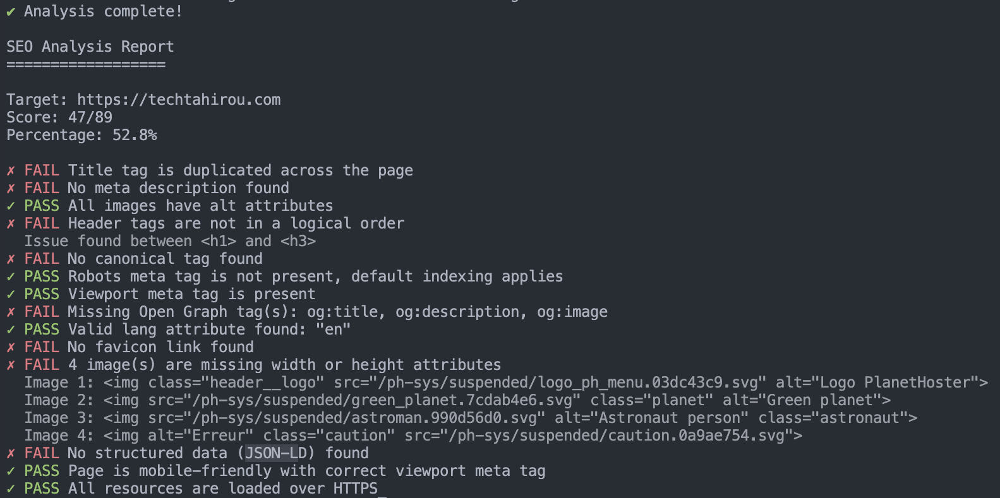

# SeoScript

A comprehensive SEO analysis tool for modern web applications. SeoScript helps you analyze and improve your website's SEO by checking common SEO rules and providing actionable insights.

## Features

- Analyze static HTML files and dynamic web pages
- Support for modern JavaScript frameworks (React, Vue.js, Angular)
- Comprehensive SEO rule checking
- Command-line interface
- Extensible rule system
- Detailed reporting

## Installation

```bash
npm install -g seoscript
```

## Usage

### Analyzing a URL

```bash
seoscript analyze --url https://example.com
```

### Analyzing a Local File

```bash
seoscript analyze --file ./index.html
```

### Options

- `--url <url>`: URL to analyze
- `--file <path>`: Local file path to analyze
- `--timeout <ms>`: Timeout for dynamic analysis (default: 30000ms)

# Example Usage

<p align="left">
  
</p>

## Development

### Setup

1. Clone the repository
2. Install dependencies:
   ```bash
   npm install
   ```

### Available Scripts

- `npm start`: Run the CLI
- `npm test`: Run tests
- `npm run build`: Build the project
- `npm run lint`: Lint the code
- `npm run format`: Format the code

## Contributing

Contributions are welcome! Please read our [Contributing Guide](CONTRIBUTING.md) for details on our code of conduct and the process for submitting pull requests.

## License

This project is licensed under the MIT License - see the [LICENSE](LICENSE) file for details.